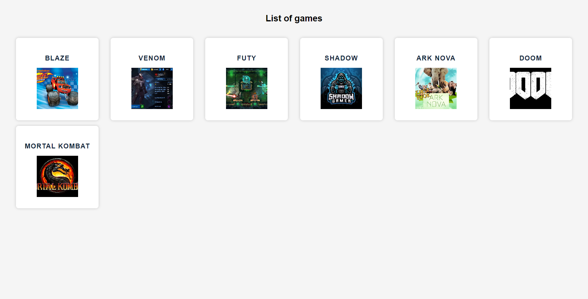
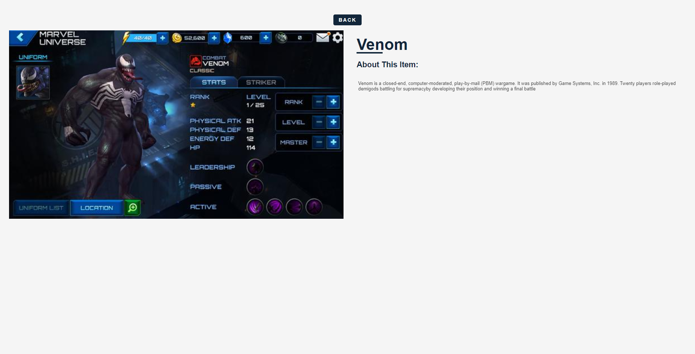

## fullstack-app-with-docke

## Installation

1- Clone the repo 
```bash
https://github.com/capo33/fullstack-app-with-docker.git
```
2- Start the app 
* in the root directory run the command
```bash
make up 
```
3- shutdown the app 
* in the root directory run the command
```bash
make down 
```


## Tech stack
- [React] 
- [Apollo-Server]
- [GraphQL]
- [Node]





   [React]: <https://react.dev/>
   [Apollo-Server]: <https://www.apollographql.com/docs/apollo-server/getting-started/>
   [GraphQL]: <https://graphql.org/>
   [Node]: <https://nodejs.org/en>